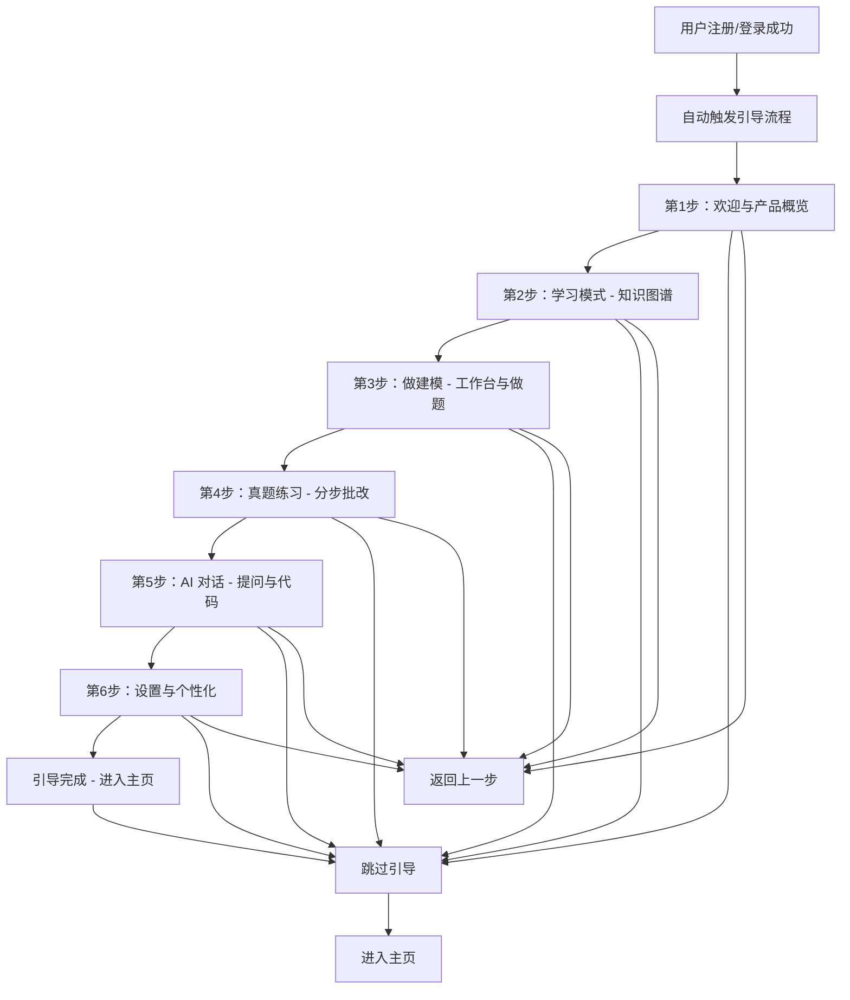

## 1. 产品概述

为用户引导流程（Onboarding Tour）模块，集成于"数学建模助教"产品中，帮助新用户在首次使用或主动触发时快速了解产品核心功能模块，并通过一个完整的示例路径从注册/登录逐步引导至完成典型任务场景。引导流程简洁明了，支持跳过和返回上一步，避免信息过载。

- 目标用户：首次注册登录的新用户、希望重新了解产品功能的存量用户
- 解决的问题：降低新用户学习成本，减少功能发现障碍，提升首次体验转化率
- 产品价值：提高新用户留存率，减少客服咨询量

## 2. 核心功能

### 2.1 用户角色

| 角色 | 注册方式 | 核心权限 |
|------|---------|---------|
| 普通用户 | 昵称+头像（本地） | 使用完整引导流程，可选择跳过 |

### 2.2 功能模块

1. **引导触发机制**：新用户注册/登录后自动弹出；老用户可通过导航入口手动触发
2. **步骤导航器**：底部进度条显示步骤总数与当前进度；支持「上一步」和「下一步」操作
3. **步骤内容卡片**：每步展示清晰的标题、图标、说明文字和界面指引
4. **跳过与完成**：任意步骤可点击「跳过引导」直接结束；最后一步展示总结并引导进入主页

### 2.3 页面详情

| 页面名称 | 模块名称 | 功能描述 |
|---------|---------|---------|
| 引导浮层 | 遮罩层 | 半透明遮罩覆盖全屏，聚焦当前步骤高亮区域 |
| 引导浮层 | 步骤卡片 | 居中或定位在目标区域旁的卡片，展示步骤序号、图标、标题、描述 |
| 引导浮层 | 进度指示器 | 底部圆点进度条，已完成为实心、当前为高亮、未完成为空 |
| 引导浮层 | 操作按钮区 | 「跳过引导」文字链接 + 「上一步」按钮 + 「下一步/开始使用」按钮 |
| 引导浮层 | 完成页 | 引导结束的祝贺卡片，展示核心功能入口快捷链接 |

## 3. 核心流程

**流程说明**：
1. 用户完成注册/登录后，系统检测是否首次登录，若是则自动弹出引导浮层
2. 引导共 6 个步骤，覆盖产品的全部核心功能模块
3. 每步展示对应功能的简要说明和操作提示
4. 用户可随时跳过引导直接进入主页
5. 用户可返回上一步重新查看
6. 最后一步完成后展示功能入口快捷面板，点击进入主页

## 4. 用户界面设计

### 4.1 设计风格

- **主色调**：沿用产品现有的新中式配色体系（宣纸白 #F7F7F6、胭脂红 #C04851、秋香色暗金 #D9B611、墨色 #2B2D30）
- **按钮风格**：圆角卡片式，主操作按钮使用胭脂红配阴影，次要操作用边框线描样式
- **字体**：标题用 Noto Serif SC（衬线），正文用 Noto Sans SC（无衬线），字号 13-20px
- **布局风格**：居中浮层卡片，底部圆点进度条，步骤卡片带轻微阴影和圆角
- **动画**：入场淡入+上移，步骤切换左右滑动，完成页缩放弹性效果

### 4.2 页面设计概览

| 页面名称 | 模块名称 | UI 元素 |
|---------|---------|---------|
| 引导浮层 | 遮罩层 | 半透明深色遮罩（rgba(43,45,48,0.6)），z-index 最高层 |
| 引导浮层 | 步骤卡片 | 白色卡片，圆角16px，阴影，内含图标+标题+描述+操作按钮 |
| 引导浮层 | 进度指示器 | 底部居中圆点行，直径10px，间距12px，当前步骤放大至14px并高亮 |
| 引导浮层 | 完成页 | 居中卡片，庆祝图标，总结文字，各功能入口快捷按钮 |

### 4.3 响应式

- 桌面端：步骤卡片最大宽度 480px，居中显示
- 移动端（<640px）：卡片宽度自适应（92vw），图标和文字缩小，进度点缩小

## 5. 步骤详细定义

### 步骤列表（共6步）

| 步骤 | 图标 | 标题 | 描述 |
|------|------|------|------|
| 1 | 👋 | 欢迎使用数学建模助教 | 基于40小时课程知识库的AI助教，帮你学建模、做题目、写代码。让我们花1分钟了解核心功能。 |
| 2 | 📚 | 学习模式 | 顺着知识图谱，从基础概念一步步点亮。每个知识点都有详细讲解和关联题目，适合系统学习。 |
| 3 | 🛠️ | 做建模 | 两种方式：自由练习工作台（IDE+终端+AI对话），或带题让助教拆步陪你一步步做。 |
| 4 | 🎯 | 真题练习 | 历年HiMCM真题分步练习，AI按评分要点给分并提供反馈，看到自己的差距在哪里。 |
| 5 | 💬 | AI 对话助手 | 随时向助教提问，支持Markdown公式渲染、Python代码编写运行、文件上传和文档读取。 |
| 6 | ✨ | 准备就绪 | 你已经了解了所有核心功能。现在可以开始你的数学建模之旅了！ |
