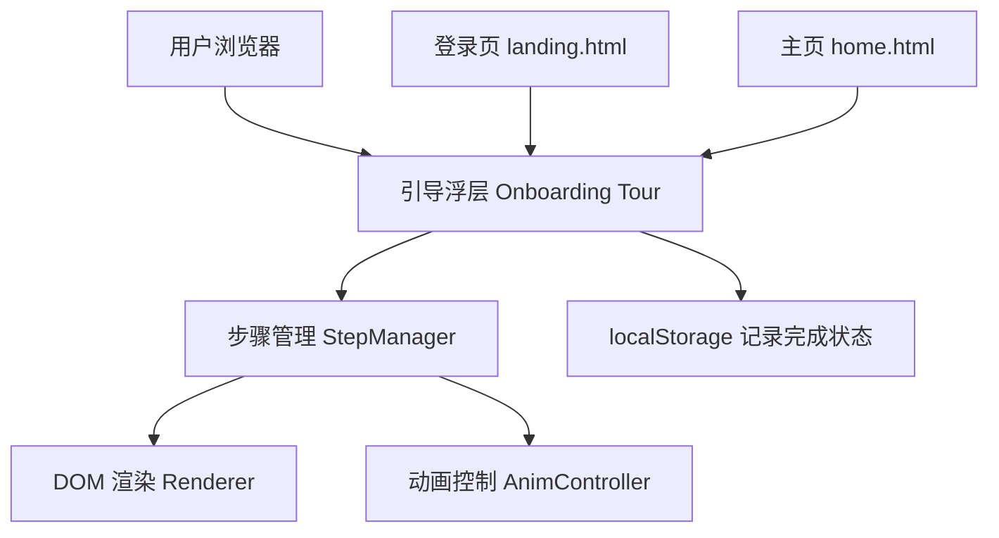
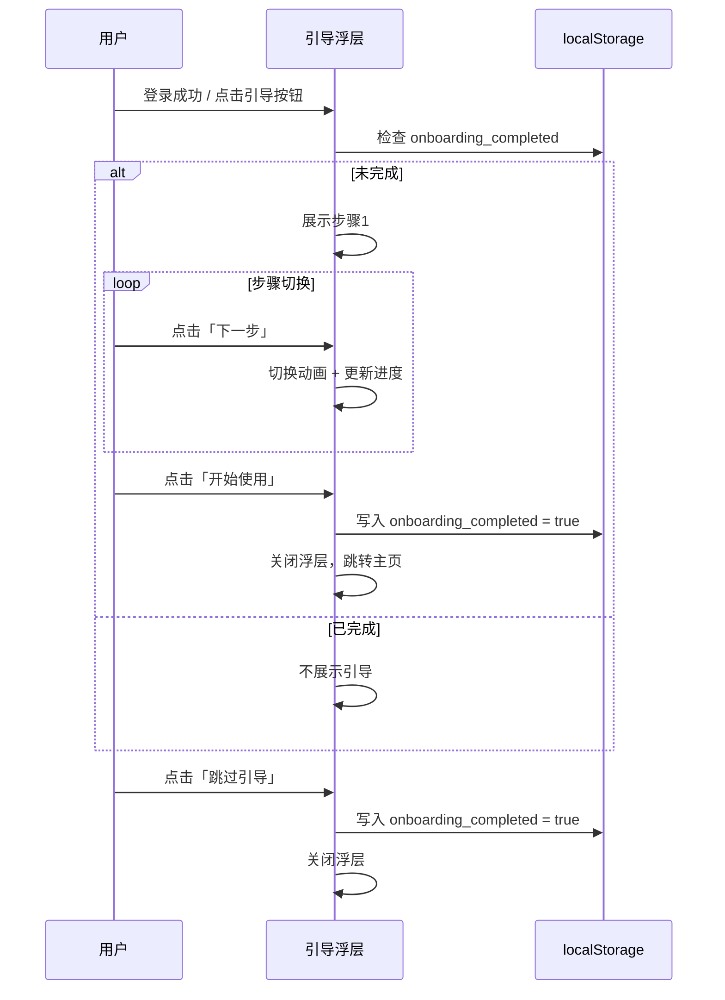

## 1. 架构设计

引导流程模块集成于现有"数学建模助教"前端项目中，采用纯前端实现方案（Vanilla HTML/CSS/JS），不依赖后端 API。



## 2. 技术说明

- **前端**：Vanilla HTML + CSS + JavaScript（与现有项目技术栈一致）
- **状态管理**：模块级闭包变量管理引导步骤状态
- **持久化**：localStorage 记录引导是否已完成
- **动画**：CSS transition + requestAnimationFrame
- **文件结构**：
  - `frontend/onboarding.html`：引导页面独立 HTML（可被其他页面以 iframe 或弹出层方式引用）
  - `frontend/onboarding.js`：引导流程核心逻辑
  - `frontend/style.css`：新增引导相关样式（追加到现有样式文件）

## 3. 路由定义

引导流程以浮层（overlay）形式注入到现有页面中，不占用独立路由：

| 集成方式 | 触发页面 | 说明 |
|---------|---------|------|
| 自动弹出 | landing.html（登录后） | 新用户注册/登录成功后自动展示 |
| 手动触发 | home.html（主页） | 顶栏「使用引导」按钮触发 |

## 4. 数据模型

### 4.1 localStorage 数据结构

```javascript
// Key: "onboarding_completed"
// Value: true | undefined
// 用于判断用户是否已完成引导
```

### 4.2 步骤数据模型

```javascript
const steps = [
  {
    id: 1,
    icon: "👋",
    title: "欢迎使用数学建模助教",
    description: "基于40小时课程知识库的AI助教...",
    accent: "#C04851", // 步骤主题色
  },
  // ...共6步
];
```

## 5. 组件结构

```
OnboardingOverlay (遮罩层 + 容器)
├── Backdrop (半透明背景)
├── StepCard (步骤卡片)
│   ├── StepIcon (步骤图标 + 圆形背景)
│   ├── StepTitle (步骤标题)
│   └── StepDescription (步骤描述)
├── ProgressDots (进度圆点指示器)
├── ActionBar (操作按钮区)
│   ├── SkipButton (跳过引导)
│   ├── PrevButton (上一步)
│   └── NextButton (下一步/开始使用)
└── CompleteView (完成页)
    ├── CelebrationIcon (庆祝图标)
    ├── Summary (总结文字)
    └── QuickLinks (功能入口快捷按钮)
```

## 6. 核心交互逻辑



## 7. 兼容性与性能

- 支持所有现代浏览器（Chrome 90+, Firefox 90+, Safari 15+, Edge 90+）
- CSS transition 用于步骤切换动画，利用 GPU 加速
- 无外部依赖，纯原生实现
- 引导浮层在非激活时 display: none 避免渲染开销
